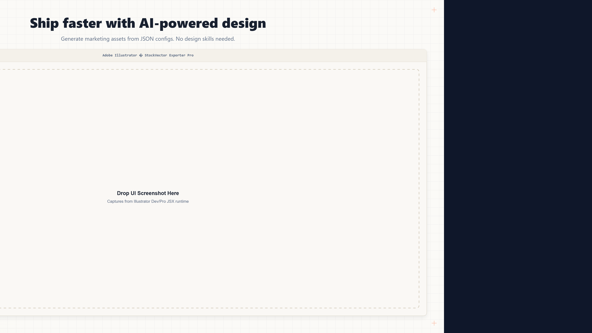
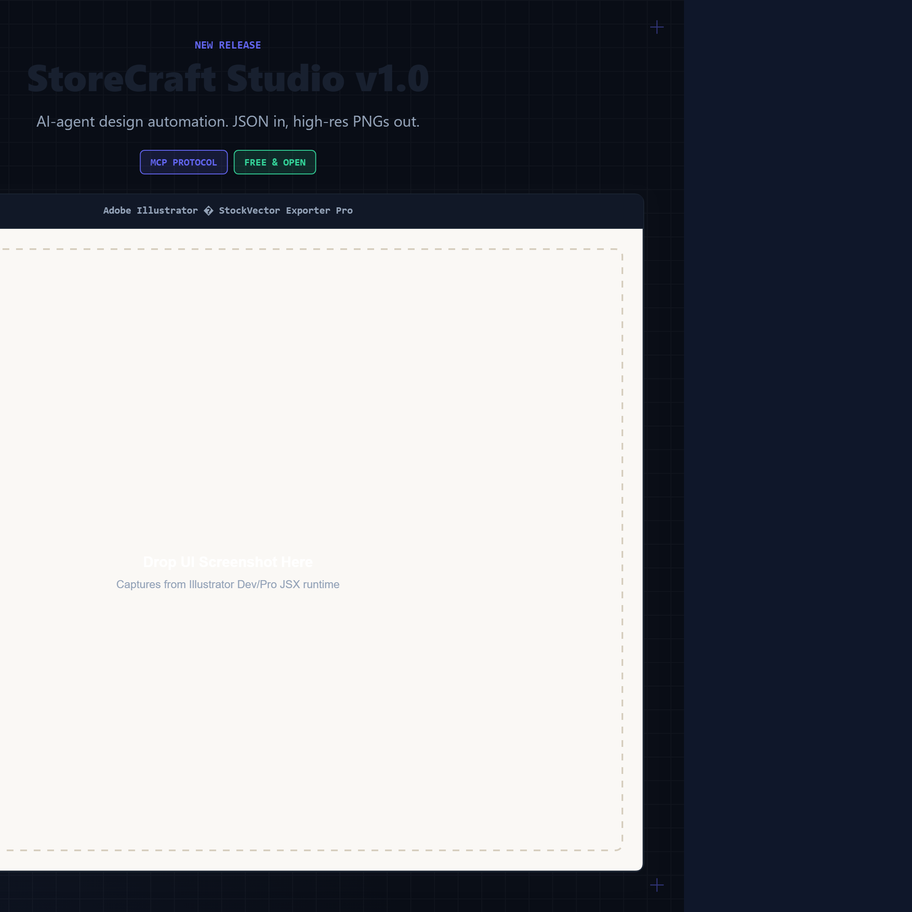
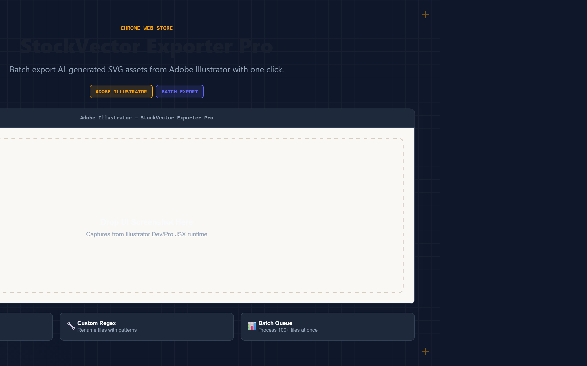
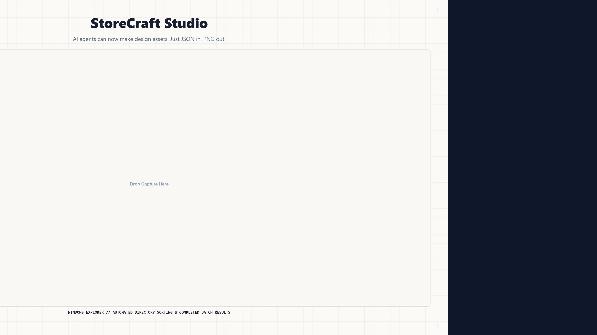

# StoreCraft Studio 🎨

**Turn JSON into production-ready design assets — by hand, or by AI agent.**

StoreCraft Studio is a deterministic design renderer + MCP server that generates high-resolution marketing images (banners, social posts, marketplace screenshots, covers) from plain JSON configs. No design skills. No API keys. No LLM guessing — the same config always produces the same pixel-perfect PNG.

Designed for **AI agents** (via [Model Context Protocol](https://modelcontextprotocol.io)) and **humans** (via CLI).

```
"Make me a Gumroad hero banner for my product"
  → agent calls list_presets     → finds marketplace-hero-1080p
  → agent calls list_themes      → picks swiss-dark
  → agent composes a JSON config from your description
  → agent calls render_design    → returns output/gumroad-hero.png ✅
```

---

## ✨ Why this is different

| Capability | StoreCraft Studio | Other MCP design servers |
|---|---|---|
| Generates **image files** (PNG) | ✅ | ❌ (mostly emit HTML/CSS) |
| **Deterministic** — no LLM at render time | ✅ | ❌ (most require an AI provider key) |
| **No API keys / BYOK** | ✅ | ❌ (several require external AI keys) |
| **35+ platform presets** out of the box | ✅ | ❌ (generic renderers) |
| **8 curated color themes** | ✅ | ❌ |
| **7 composable layouts** | ✅ | ❌ |
| Works offline, fully local | ✅ | ❌ |

The closest prior art is Vercel's `@json-render/image`, but that's a generic image renderer. StoreCraft Studio is purpose-built for **marketing asset creation** — the kind of thing you'd otherwise open Canva or Photoshop for.

---

## 🖼️ What it produces



 



---

## 🚀 Quick Start (CLI)

```bash
npm install
npx playwright install chromium

# Start the render server (needed by both CLI and MCP)
npm run dev
```

Render a template:

```bash
npm run render -- templates/demo-banner.json --output output/demo.png
```

Render an inline config:

```bash
npm run render -- '{"preset":"marketplace-hero-1080p","theme":"swiss-dark","headline":"My Product","subtitle":"Ship faster"}'
```

List presets and themes:

```bash
npm run render -- presets
npm run render -- themes
```

---

## 🤖 Quick Start (MCP — for AI agents)

Add to your **Claude Desktop** config (`claude_desktop_config.json`):

```json
{
  "mcpServers": {
    "storecraft-studio": {
      "command": "node",
      "args": ["C:\\path\\to\\storecraft\\studio\\mcp-server.js"]
    }
  }
}
```

Or **Cursor** (`.cursor/mcp.json`):

```json
{
  "mcpServers": {
    "storecraft-studio": {
      "command": "node",
      "args": ["C:\\path\\to\\storecraft\\studio\\mcp-server.js"]
    }
  }
}
```

> Start `npm run dev` first — both the CLI and MCP render via the local Vite server on `http://localhost:3100`.

### Available tools

| Tool | Description |
|---|---|
| `list_presets` | List all design presets (sizes/platforms) |
| `list_themes` | List all color themes |
| `render_design` | Render a JSON config to a high-res PNG |
| `save_template` | Save a config as a reusable JSON template |
| `load_template` | Load a saved template by name |
| `list_templates` | List all saved templates |

---

## 📐 Presets (35+)

### Marketplace
`marketplace-hero-1080p` · `marketplace-standard` · `marketplace-hd` · `square-thumbnail` · `envato-banner`

### Chrome Web Store
`cws-screenshot` · `cws-small-tile` · `cws-marquee` · `cws-icon`

### Social Media
`twitter-header` · `twitter-post` · `instagram-post` · `instagram-story` · `instagram-carousel` · `linkedin-post` · `linkedin-banner` · `facebook-post` · `facebook-cover` · `youtube-thumbnail` · `youtube-banner` · `discord-banner` · `tiktok-thumbnail` · `pinterest-pin`

### OpenGraph
`opengraph-card`

### Banners
`blog-hero` · `newsletter-header` · `podcast-cover` · `banner-leaderboard` · `banner-medium` · `banner-skyscraper`

### Presentations
`slides-16-9` · `slides-4-3`

### Custom
`custom` — any width × height

---

## 🎨 Themes (8)

`swiss-light` · `warm-paper` · `swiss-dark` · `obsidian-indigo` · `ocean-blue` · `emerald-dark` · `rose-dark` · `minimal-white`

---

## 🧩 Layouts

`split-feature-right` (default) · `split-feature-left` · `hero-centered` · `full-window` · `three-card-gallery` · `side-by-side-cards` · `widescreen-showcase`

---

## 📄 Config reference

```json
{
  "preset": "marketplace-hero-1080p",
  "theme": "swiss-dark",
  "layout": "hero-centered",
  "headline": "Your headline here",
  "subtitle": "A short supporting subtitle",
  "kicker": "NEW RELEASE",
  "badges": [
    { "text": "MCP Native", "bg": "#10b981", "color": "#ffffff" }
  ],
  "callouts": [
    { "icon": "⚡", "title": "Fast", "desc": "Renders in <1s" }
  ],
  "screenshotUrl": "path/to/image.png",
  "frameTitle": "product.com — screenshot window title",
  "gridEnabled": true
}
```

---

## 🗂️ Project structure

```
studio/
├── mcp-server.js        # MCP server (6 tools for AI agents)
├── cli.js               # CLI wrapper (render / presets / themes)
├── index.html           # Canvas host + Google Fonts loader
├── vite.config.js       # Dev server on :3100
├── src/
│   ├── canvas.js        # Canvas 2D rendering engine (all layouts)
│   ├── presets.js       # 35+ presets + 8 color themes
│   └── renderer.js      # window.StoreCraft browser API
├── templates/           # Example JSON templates
├── output/              # Rendered PNGs
└── demo/                # Showcase images for the README
```

---

## 🧠 How it works

1. **You or an agent** write a JSON config (preset + theme + layout + text).
2. The config is passed to `window.StoreCraft` in a headless browser via **Playwright**.
3. The **Canvas 2D engine** draws the design pixel-by-pixel at high DPI.
4. The canvas is captured to a **high-res PNG** — deterministic, reproducible, no server needed.

---

## 📜 License

MIT © Niloy Pal
